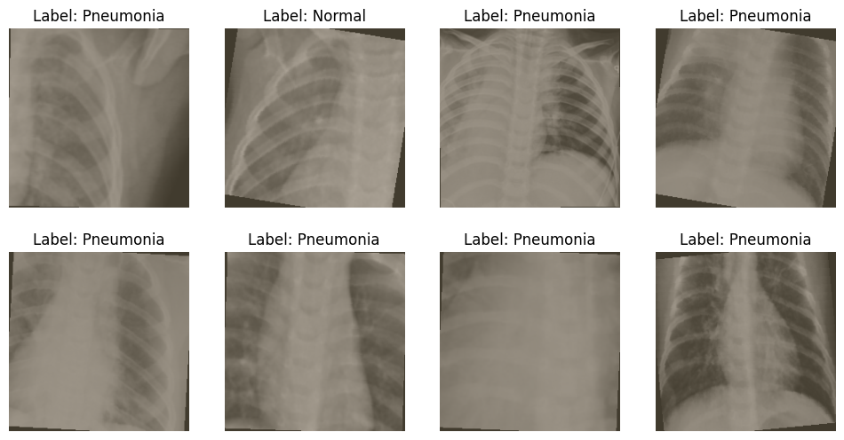
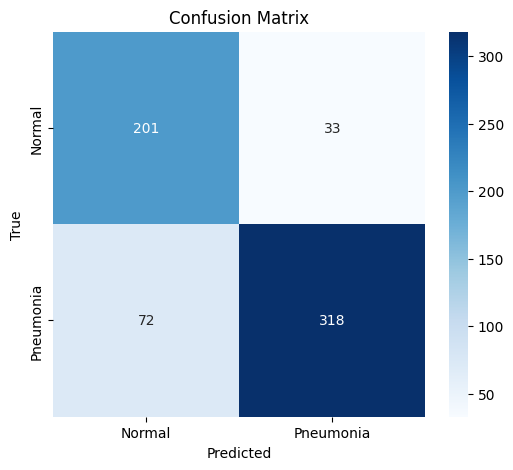
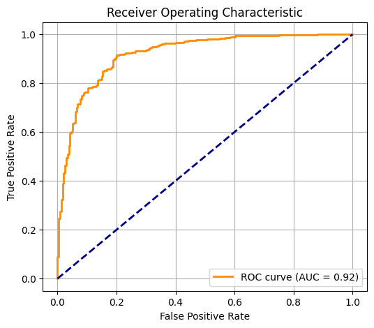
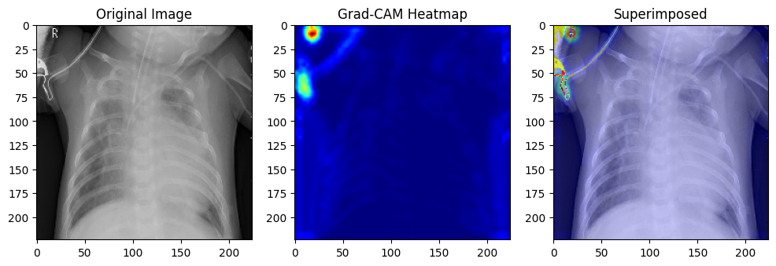

# Pneumonia X-Ray Image Classification task

## Aim is to correctly classify Pneumonia using a CNN model & visualize the area where model focuses for prediction

#### X-Ray images after simple Transformation:

#### Loss and Accuracy during training and validation:

Training Loss: 0.3567 
Training Accuracy: 0.8436

Validation Loss: 0.5079
Validation Accuracy: 0.8125

#### Confusion Matrix:

True Positives = 318
True Negative = 201

False Positive = 33
False Negative = 72

#### ROC Curve:

#### Pytorch 'Hooks' function is used to focus in the last convolutional layer 
#### so we can visualize the image from model's perspective

